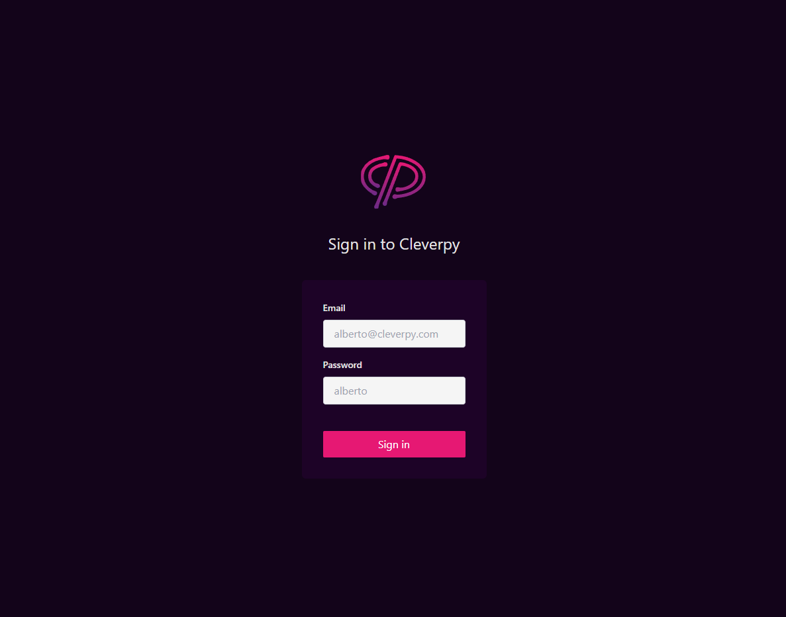

<h1 align="center">Cleverpy Cards</h1>
<p>
  
  <a href="https://twitter.com/AlbertoCruzdev" target="_blank">
    
  </a>
</p>

> Technical Interview

<a href="https://cleverpycards.vercel.app" target="_blank">
    
</a>

### ✨ [Demo](https://cleverpycards.vercel.app)

## How log in ?
The email and password have that be the same for can access the app.

Example

- Email: example@gmail.com
- Password: example

## Implementations 
- Login Page
- Post Page
- Post Functionality (Edit, Remove)
- Animations
- Sidebar
- Unit Testing


## Install

```sh
npm install
```

## Usage

```sh
npm run dev
```

## Run tests

```sh
npm run test
```

## Design

https://www.figma.com/file/S9MCYbgR7RltZMZrCsuXQm/Untitled?node-id=0%3A1

## Tech
- NextJS
- React
- Typescript
- Redux Toolkit
- React Query
- TailwindCSS
- React Testing Library

## Author

👤 **Alberto Cruz Luis**

* Website: albertocruzluis.com
* Twitter: [@AlbertoCruzdev](https://twitter.com/AlbertoCruzdev)
* Github: [@AlbertoCruzLuis](https://github.com/AlbertoCruzLuis)
* LinkedIn: [@albertocruzluis](https://linkedin.com/in/albertocruzluis)

## Show your support

Give a ⭐️ if this project helped you!

***
_This README was generated with ❤️ by [readme-md-generator](https://github.com/kefranabg/readme-md-generator)_